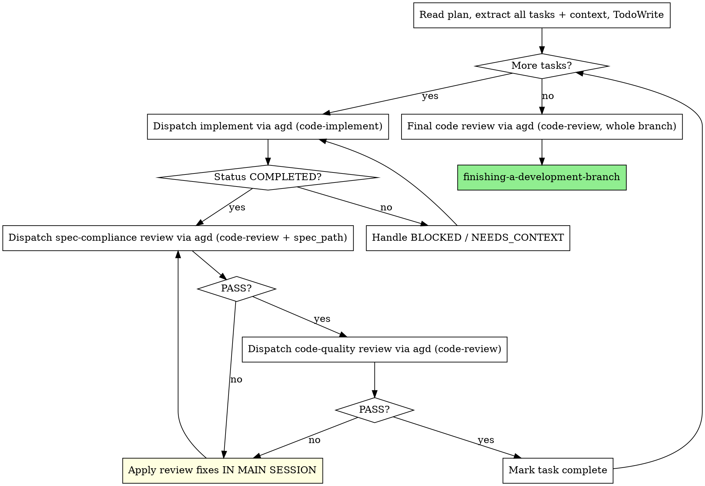

# Wen's Implement-Plan Flow

Executes an implementation plan by following the `subagent-driven-development` loop, but **every** dispatched subtask (implement, spec-compliance review, code-quality review) goes out to `agd` instead of an in-session subagent. This trades a small amount of orchestration overhead for a dramatically smaller main-session context.

Embeds its own copy of `dispatch.sh` + templates — no need to load `agd-dispatch`.

## Assumptions

All referenced skills are installed. Don't validate them.

- `subagent-driven-development`, `using-git-worktrees`, `finishing-a-development-branch`
- `agd` is on `PATH` and configured to allow file writes for `code-implement` / `review-implement` tiers
- `docs/tmp/` is in `.gitignore`

## Workflow

Invoke `subagent-driven-development` for the overall loop — but substitute its "dispatch subagent" steps with `agd` dispatch calls per the table below. **Do not pick models per task** — `agd` handles that.



## Dispatch Recipes

`scripts/dispatch.sh` lives next to this file. Use these recipes verbatim.

### Implement a task

```bash
sh skills/wens-plan-implementer/scripts/dispatch.sh \
    --template code-implement \
    --var repo_root="$(git rev-parse --show-toplevel)" \
    --var spec_path=<spec> \
    --var plan_path=<plan> \
    --var stage="task <N>: <short slug>" \
    --var task_body="<full task text from plan>" \
    --skills test-driven-development,verification-before-completion
```

`task_body` must fit on a single line (no real newlines). For long tasks, point at a file the plan already contains and put just a one-line summary here.

### Spec-compliance review (stage 1)

```bash
sh skills/wens-plan-implementer/scripts/dispatch.sh \
    --template code-review \
    --var repo_root="$(git rev-parse --show-toplevel)" \
    --var diff_scope="HEAD~1..HEAD" \
    --var files_changed="$(git diff --name-only HEAD~1..HEAD | tr '\n' ',' | sed 's/,$//')" \
    --var spec_path=<spec> \
    --var stage="task <N> spec-review" \
    --skills systematic-debugging \
    --guidance "Spec-compliance review only: does this implement the task as specified? Ignore style nits."
```

### Code-quality review (stage 2, only after stage 1 PASSes)

```bash
sh skills/wens-plan-implementer/scripts/dispatch.sh \
    --template code-review \
    --var repo_root="$(git rev-parse --show-toplevel)" \
    --var diff_scope="HEAD~1..HEAD" \
    --var files_changed="$(git diff --name-only HEAD~1..HEAD | tr '\n' ',' | sed 's/,$//')" \
    --var stage="task <N> quality-review" \
    --skills systematic-debugging \
    --guidance "Code-quality review: correctness, tests, clarity, surgical scope, idioms. Spec compliance already verified."
```

Omit `spec_path` for stage 2 to keep the reviewer focused on quality.

### Final whole-branch review (after all tasks done)

```bash
BASE=$(git merge-base HEAD main)
sh skills/wens-plan-implementer/scripts/dispatch.sh \
    --template code-review \
    --var repo_root="$(git rev-parse --show-toplevel)" \
    --var diff_scope="${BASE}..HEAD" \
    --var files_changed="$(git diff --name-only ${BASE}..HEAD | tr '\n' ',' | sed 's/,$//')" \
    --var spec_path=<spec> \
    --var stage="final" \
    --skills systematic-debugging
```

## Applying Review Feedback (Main Session)

When a review returns `status: ISSUES_FOUND` with blockers/majors, **apply fixes in the main session** — don't dispatch `review-implement`. Reasoning:

- Review reports are small; reading them locally is cheap.
- Fixes are usually surgical (1-3 files).
- Avoids an extra `agd` round-trip per review cycle.
- Keeps the loop tight: fix → commit → re-dispatch reviewer.

Only escalate back to `agd` (via `--template review-implement`) if fixes balloon beyond a few files or the user explicitly asks.

## Loop Rules

- **Continuous execution.** Don't check in between tasks. Stop only on un-resolvable `BLOCKED`, structural ambiguity, or all-tasks-complete.
- **Stage order is fixed.** Spec-compliance must PASS before quality review starts. Don't merge the two.
- **Re-review after every fix.** Reviewer found issues → fix → re-dispatch same reviewer. Skipping the re-review breaks the gate.
- **Hard cap 5 rounds per review stage.** If still failing, surface to the user — task or spec likely has a structural problem.
- **Minor-only is PASS.** Don't loop on minors; note them and proceed.

## Read the YAML Frontmatter

Every dispatch output (`docs/tmp/<ts>-<template>.out.md`) starts with a YAML block:

- `code-implement` / `review-implement`: `status: COMPLETED | BLOCKED | PARTIAL`
- `code-review`: `status: PASS | ISSUES_FOUND` + `issues:` list with `severity: blocker | major | minor`

Parse it. Don't infer status from prose.

## Red Flags

- Dispatching multiple implement tasks in parallel — they will conflict on the working tree.
- Skipping spec-compliance and going straight to quality review.
- Dispatching `review-implement` for tiny fixes — apply them in main session.
- Letting the implementer also do its own review — reviewer must be a separate dispatch.
- Forgetting to update TodoWrite after each task — orchestration relies on it.
- Auto-running `finishing-a-development-branch` without user sign-off after final review.
